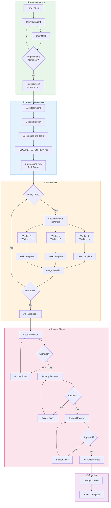

# SwarmOps

**Orchestrate parallel AI agent workers to build software projects.**

<p align="center">
  
</p>

SwarmOps manages swarms of AI agents that work together to complete software projects. Built on [OpenClaw](https://github.com/openclaw/openclaw) as its execution engine, it handles the full lifecycle from requirements gathering through code review — spawning workers in parallel, managing git isolation, and coordinating multi-stage review chains.

## How It Works

```
Interview → Specification → Build → Review → Complete
```

1. **Interview** — Chat with an AI to gather project requirements
2. **Specification** — Architect agent designs the solution and decomposes into tasks
3. **Build** — Multiple builder agents work in parallel, each in isolated git worktrees
4. **Review** — Sequential review chain (code → security → design) with automatic fixes
5. **Complete** — Merge to main when all reviews pass

## Key Features

- **Parallel Execution** — Spawn multiple workers simultaneously with dependency-aware scheduling
- **Git Isolation** — Each worker operates in its own worktree, merged after completion
- **Role-Based Agents** — Configurable roles with custom models, thinking levels, and prompts
- **Review Chain** — Multi-stage code review with automatic fix-and-retry loops
- **Smart Conflict Resolution** — AI-powered merge conflict resolution
- **Spawn Safeguards** — Circuit breaker, rate limiting, and task deduplication to prevent runaway sessions
- **Real-time Dashboard** — Monitor workers, view logs, manage projects

## Screenshots

<p align="center">
  <br>
  <em>Real-time worker monitoring — 24 parallel agents building a project</em>
</p>

<p align="center">
  <br>
  <em>Task progress view with auto-advance status indicators</em>
</p>

## Architecture

SwarmOps consists of:

- **Dashboard** — Nuxt 4 web UI for project management and monitoring
- **Orchestrator** — Core logic for task scheduling, worker management, and phase transitions
- **Gateway Integration** — Connects to [OpenClaw](https://github.com/openclaw/openclaw) for AI agent spawning

## Quick Start

```bash
# Clone and install
git clone https://github.com/siimvene/SwarmOps.git
cd SwarmOps
./install.sh

# Start the server
cd dashboard && node .output/server/index.mjs
```

The dashboard runs on `http://localhost:3000` by default.

### Requirements

- Node.js 20+
- [OpenClaw Gateway](https://github.com/openclaw/openclaw) running locally

## Project Structure

```
SwarmOps/
├── dashboard/          # Nuxt 4 web application
│   ├── app/           # Vue components, pages, composables
│   ├── server/        # Nitro API routes and utilities
│   └── public/docs/   # Built-in documentation
├── packages/
│   └── orchestrator/  # Core orchestration logic (TypeScript)
└── data/
    └── orchestrator/  # Runtime data (roles, pipelines, state)
```

## Configuration

### Roles

The install script sets up 9 pre-configured roles in `data/orchestrator/roles.json`:

| Role | Model | Purpose |
|------|-------|---------|
| `architect` | Claude Opus | High-level system design and planning |
| `task-decomposer` | Claude Opus | Break down requirements into parallel tasks |
| `builder` | Claude Sonnet | Implement features and write code |
| `reviewer` | Claude Opus | Code review and quality gates |
| `security-reviewer` | Claude Opus | Security-focused vulnerability review |
| `designer` | Claude Sonnet | UI/UX design review |
| `researcher` | Claude Opus | Deep dives and competitive analysis |
| `workflow-coordinator` | Claude Sonnet | Multi-step workflow management |
| `quant-analyst` | Claude Sonnet | Trading strategies and market analysis |

Each role includes detailed instructions. Customize in the dashboard under **Roles**.

### Environment Variables

| Variable | Description |
|----------|-------------|
| `OPENCLAW_GATEWAY_URL` | Gateway API URL (default: `http://127.0.0.1:18789`) |
| `OPENCLAW_GATEWAY_TOKEN` | Auth token for dashboard access |
| `PROJECTS_DIR` | Path to projects directory |
| `ORCHESTRATOR_DATA_DIR` | Path to orchestrator state |

## Pipeline Flow



### Phase Transitions

| From | To | Trigger |
|------|-----|---------|
| Interview | Spec | `interview.json` has `complete: true` |
| Spec | Build | `specs/IMPLEMENTATION_PLAN.md` created |
| Build | Review | All tasks in `progress.md` marked `[x]` |
| Review | Complete | All reviewers approve |

The **phase watcher** polls every 30 seconds and advances projects automatically when conditions are met.

## Documentation

Built-in docs are available at `/docs` in the dashboard, covering:

- Architecture and system design
- Agent context and prompts
- Operations and monitoring
- Resilience and error handling

## License

MIT
